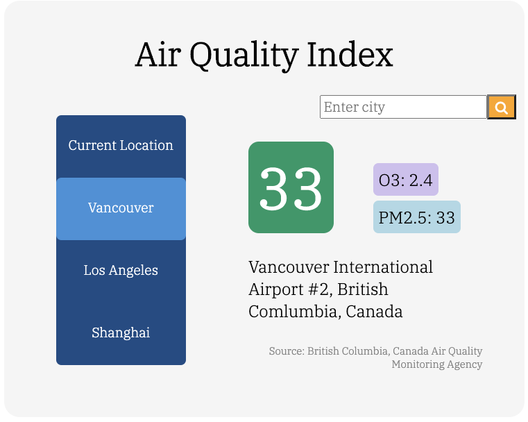

# Air Quality Index App

This is an air quality index web interface that displays real time air quality information for cities around the world. 

The search box on the right displays the air quality data for any valid city that you input. If the search box input is not a valid city, a pop-up alert will appear. 

To see the air quality data for your current location, press the "Current Location" tab. Your browser will prompt you to allow location access by the website, click "Allow" in order to use this feature. 

The colour displayed with the AQI value represents a general level of concern and is dependent on the value.

See [U.S. Environmental Protection Agency's website](https://www.airnow.gov/aqi/aqi-basics/) for a full explanation of the Air Quality Index. 

### Credits
API by [World Air Quality Index](https://waqi.info/)
